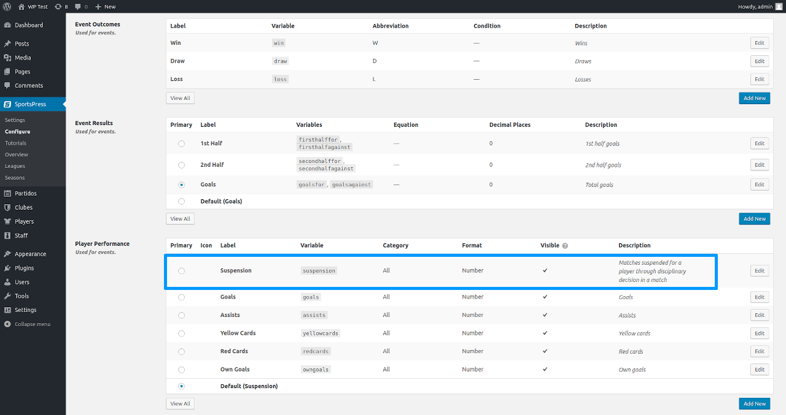
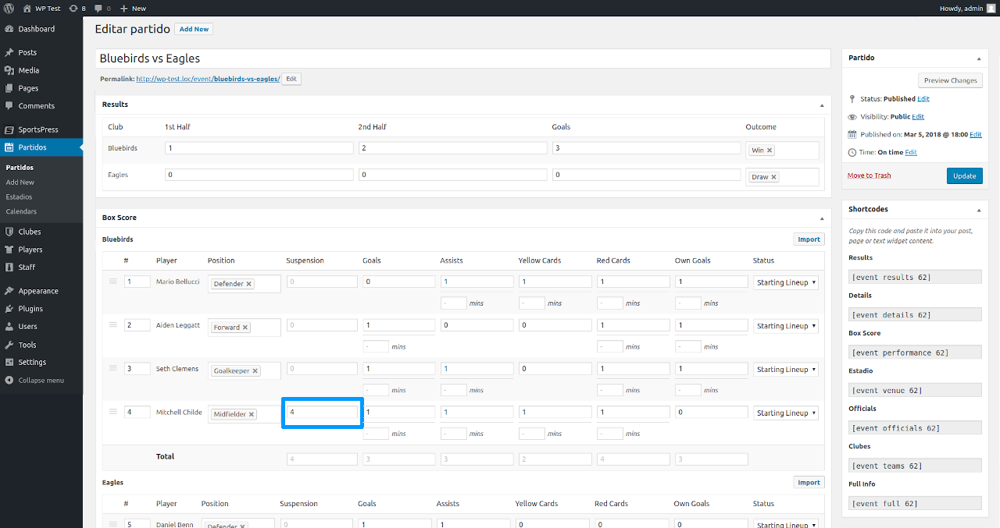
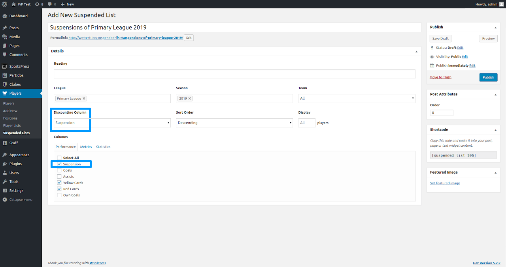
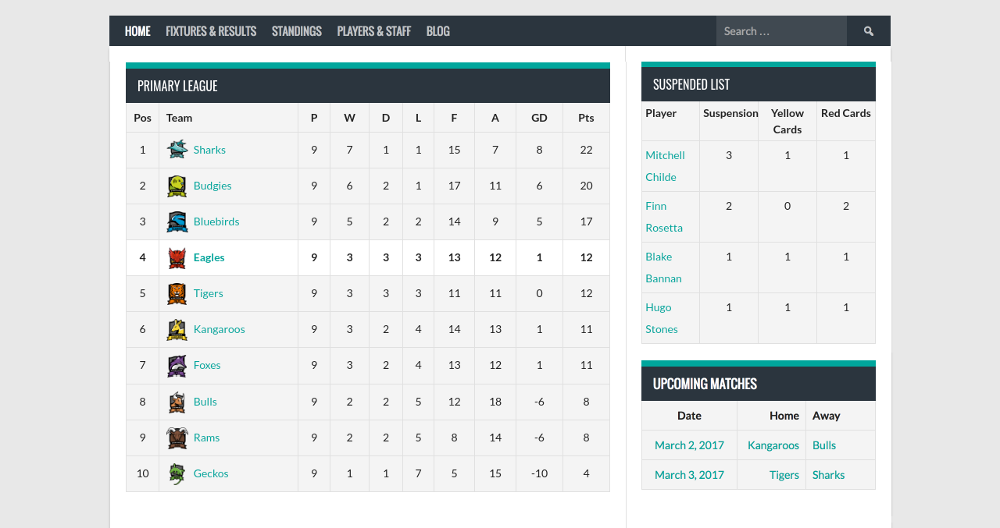

# Suspended Lists for SportsPress

Suspended Lists for SportsPress is an extension for SportsPress, an all-in-one sports data plugin that helps sports clubs set up and manage a league or club site quickly and easily.

## Description

Suspended Lists for SportsPress help you to build suspended players lists that discount automatically after each team match day.

[WordPress Plugin Page](https://wordpress.org/plugins/suspended-lists-for-sportspress/)

### Available Languages
- English – English (en_US)
- Spanish – Español (es_ES)

### Please Rate, Vote, and Enjoy!
Your feedback is much appreciated and makes all the difference in improving Suspended Lists for SportsPress.

## Installation

### Minimum Requirements
- WordPress 3.8 or greater
- [SportsPress](https://wordpress.org/plugins/sportspress/) 2.3 or greater

### Automatic Installation

Automatic installation is the easiest option as WordPress handles the file transfers itself and you don't even need to leave your web browser. To do an automatic install of Suspended Lists for SportsPress, log in to your WordPress admin panel, navigate to the Plugins menu and click Add New.

In the search field type "Suspended Lists for SportsPress" and click Search Plugins. Once you've found our suspended lists plugin you can view details about it such as the point release, rating and description. Most importantly of course, you can install it by simply clicking Install Now. After clicking that link you will be asked if you're sure you want to install the plugin. Click yes and WordPress will automatically complete the installation.

### Manual Installation

The manual installation method involves downloading our suspended lists plugin and uploading it to your webserver via your favorite FTP application.

1. Download the plugin file to your computer and unzip it
2. Using an FTP program, or your hosting control panel, upload the unzipped plugin folder to your WordPress installation's wp-content/plugins/ directory.
3. Activate the plugin from the Plugins menu within the WordPress admin.

## Screenshots

1. Player Performance configuration screen. You can configure variable to be used by this plugin.

2. The Edit Match screen. You can set number of match suspended by player.

3. Add New Suspended List. You can set discounting column and select it and select others to be displayed in the list.

4. Add suspended list using shortcode where you need.

## Frequently Asked Questions

### Will Suspended Lists for SportsPress work with my theme?

Yes; Suspended Lists for SportsPress will work with any theme, but may require some styling to make it match nicely.

### Where can I report bugs or contribute to the project?

Bugs can be reported either in our support forum.

## Changelog

### 0.0.2
- Feature - Add team, position, and rank columns to administration and template.
- Feature - Add new copy translation in Spanish language.
- Feature - Calculate remaining suspension with correct event statuses.
- Fix - Remove entry details in suspended list front end.
- Fix - Names in classes inclusions.
- Fix - Name in class instantiation.
- Fix - Navigation menu classes.

### 0.0.1
- Alpha release for first look and testing.

## Author
Leandro Ibarra

## License
[GPL2](https://www.gnu.org/licenses/gpl-2.0.html)